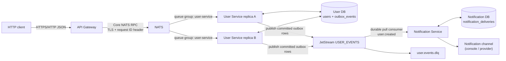

# Architecture

## Boundaries and data ownership

The API Gateway is the public HTTP boundary. It validates HTTP input, applies
rate limits to authentication routes, verifies/creates JWTs, and translates
User Service RPC errors into HTTP responses. It does not access either service
database.

The User Service owns `users` and `outbox_events` in the `trams` database. It
performs password hashing and credential verification, but never creates JWTs.
The Notification Service owns `notification_deliveries` in the separate
`trams_notifications` database. It never reads User Service tables.

Shared libraries deliberately contain only contracts and reusable messaging
plumbing. Service-specific RPC subjects, handlers, repositories, and clients
remain with the service that owns them.



NATS is one broker in the local Compose environment. The `USER_EVENTS` stream
has one replica, so this local stack is not broker-highly-available. User
Service RPC _is_ horizontally scalable: every replica subscribes to the same
subjects in the same queue group, and NATS selects one replica for each request.

## Request/reply flow

For `POST /api/auth/signup`, the Gateway validates the request, passes it to
`user.rpc.create`, and waits for a reply. User Service validates the same shared
DTO, creates the user and outbox event transactionally, then replies. The
Gateway returns the user record. The login flow is similar, except User Service
verifies a password and Gateway signs the resulting JWT. `GET /api/users/{id}`
and `PUT /api/users/{id}` require a bearer token and only allow the token's
subject to access the matching path ID.

Core NATS request/reply messages are transient: they are appropriate when the
caller needs an immediate answer. User Service only accepts the defined private
RPC subjects. The Gateway can only publish requests and subscribe to its inbox;
it does not have permission to publish user events directly.

## Outbox sequence

The outbox avoids the unreliable "write database, then publish event" sequence.
If database write and broker publish were separate, a crash between them could
create a user without its event. Instead, the durable outbox row is committed
with the user. Publishing happens afterwards and can be retried safely.

```mermaid
sequenceDiagram
    participant C as HTTP Client
    participant G as API Gateway
    participant N as NATS RPC
    participant U as User Service
    participant D as User DB
    participant R as Outbox Relay
    participant J as JetStream
    participant S as Notification Service
    participant ND as Notification DB

    C->>G: POST /api/auth/signup (request ID)
    G->>N: request user.rpc.create
    N->>U: one queue-group replica
    U->>D: BEGIN; insert user; insert outbox event; COMMIT
    U-->>N: RPC success(user)
    N-->>G: reply
    G-->>C: 201 user

    loop Until a row is published
        R->>D: claim available outbox row
        R->>J: publish user.created (eventId as message ID)
        alt JetStream acknowledges publish
            R->>D: mark row published
        else Broker/publish failure
            R->>D: store error and nextAttemptAt
        end
    end

    J->>S: durable pull delivery of user.created
    S->>ND: claim eventId delivery lease
    S->>S: send notification with eventId idempotency key
    S->>ND: mark delivery sent
    S->>J: explicit ACK
```

The relay leases rows before publishing, so two User Service replicas normally
cannot publish the same row at once. Leases expire, allowing recovery after a
process crash. JetStream message IDs also use the event ID during its duplicate
window. Consumers must still be idempotent because delivery is at least once.

## Failure and retry behavior

| Failure                                                                      | Behavior                                                                                                                                                                                                    |
| ---------------------------------------------------------------------------- | ----------------------------------------------------------------------------------------------------------------------------------------------------------------------------------------------------------- |
| Gateway cannot reach NATS or no User Service responder exists                | The RPC client returns an error mapped to HTTP `503`. Readiness returns `503`.                                                                                                                              |
| User Service does not reply before the RPC timeout                           | The Gateway maps the timeout to HTTP `504`.                                                                                                                                                                 |
| User database transaction fails                                              | Both user and outbox changes roll back; no success response or event is published.                                                                                                                          |
| Relay cannot publish a committed outbox row                                  | It records the error and retries with capped exponential backoff. Published rows are retained for seven days then cleaned in bounded batches.                                                               |
| Notification handler fails                                                   | The durable consumer NAKs the message for redelivery. Its configured delays are 1s, 5s, 30s, 5m, and 15m, with at most five deliveries.                                                                     |
| Valid event exhausts delivery attempts                                       | The exact original bytes are published to `user.events.dlq` with source, consumer, delivery-count, event-ID, and error headers. Only then is the source message terminated.                                 |
| Event cannot be decoded                                                      | The raw bytes are preserved in the DLQ before the source message is terminated. If DLQ publish fails, the source message is NAKed rather than discarded.                                                    |
| Notification replica crashes after provider acceptance but before `markSent` | The event can be redelivered. The service-owned database prevents duplicates once marked sent; a real provider must also use `eventId` as its idempotency key to close this final external side-effect gap. |

The outbox relay emits structured operational logs for pending/retrying rows,
oldest pending age, publishing failures, and cleanup. The DLQ utility supports
inspection and deliberate replay. It defaults to dry-run, retains the original
DLQ record for audit, and requires a corrected contract-valid payload for
malformed records.

## Security and observability

- All local NATS client connections use TLS. Application containers receive the
  CA only; the broker receives the server private key.
- NATS accounts have per-service permissions. The Gateway cannot access the
  database or publish domain events; Notification Service cannot invoke User
  RPC.
- Passwords are hashed in User Service and never included in user responses or
  events.
- JWTs are signed and verified only by API Gateway using HS256. User Service
  handles credentials but does not need the JWT secret.
- Gateway uses `pino-http`, redacts Authorization/cookie headers, and adds an
  `x-request-id` response header. The same value travels on NATS RPC headers
  and is logged by User Service.

For endpoint-level request and response schemas, see
[docs/openapi.yaml](openapi.yaml).
